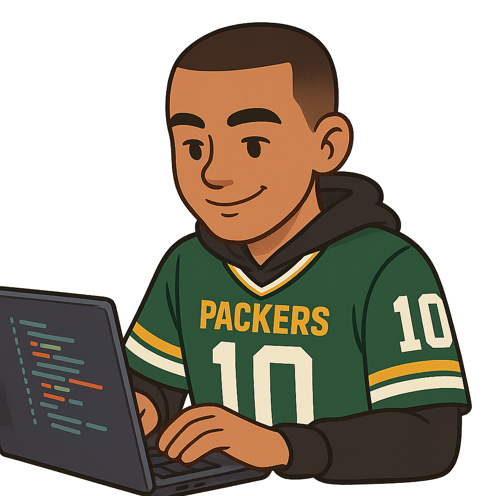

  

###

###

<h1 align="center">Hi 👋, I'm Rodrigo Oliveira</h1>
<h3 align="center">Full stack developer from Brazil</h3> 

- 🔭 I’m currently working at 

- 🌱 I’m currently learning **React, TypeScript, and Next.js**

- 📫 How to reach me **coderodrigo07@gmail.com**

  <strong>Some of my skills:</strong>  
  
  
  
  
  
  

 

  
  
  
  
  
  

 

